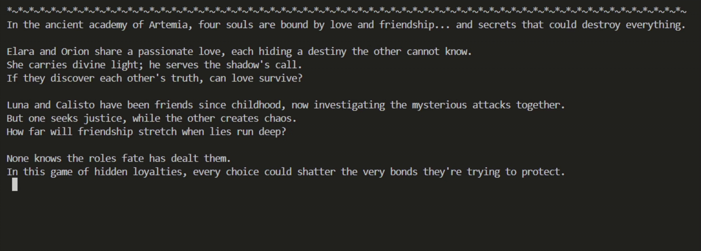
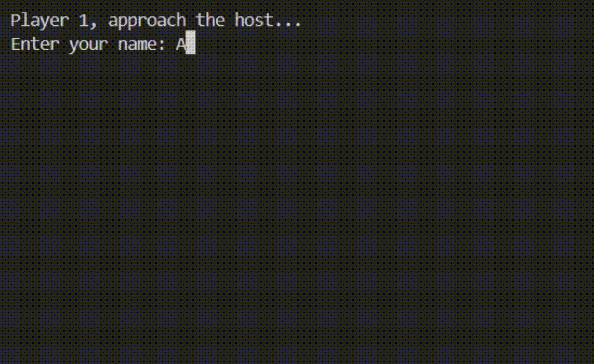

<div align="center">⠀⠀⠀⠀⠀⠀⠀⠀⠀⠀⠀⠀⠀⠀⠀⠀⠀⠀⠀⠀⠀⠀⠀⠀⠀⠀⠀⠀⠀⠀⠀⠀⠀⠀⠀⠀⠀⠀⠀⠀⠀⠀⠀⠀⠀⠀
⠀⠀⠀⠀⠀⠀⠀⠀⠀⠀⠀⠀⠀⠀⠀⠀⠀⠀⠀⠀⠀⠀⠀⠀⠀⠀⠀⠀⠀⠀⠀⠀⠀⠀ ⡄⠀⠀⠀⠀⠀⠀⠀⠀⠀⠀⠀⠀⠀⠀
⠀⠀⠀⠀⠀⠀⠀⠀⠀⠀⠀⠀⠀⠀⠀⠀⠀⠀⠀⠀⠀⠀⠀⠀⠀⠀⠀⠀⠀⠀⠀⠀⠀⠀⢸⡇⠀⠀⠀⠀⠀⠀⠀⠀⠀⠀⠀⠀⠀⠀
⠀⠀⠀⠀⠀⠀⠀⠀⠀⠀⠀⠀⠀⠀⠀⠀⠀⠀⠀⠀⠀⠀⠀⠀⠀⠀⠀⠀⠀⠀⠀⠀⠀⠀⡜⣇⠀⠀⠀⠀⠀⠀⠀⠀⠀⠀⠀⠀⠀⠀
⠀⠀⠀⠀⠀⠀⠀⠀⠀⠀⠀⠀⠀⠀⠀⠀⢀⣠⣤⣤⠤⢀⠀⠀⠀⠀⠀⠀⠐⠒⠒⠒⠶⠮⣅⣿⠛⠶⠖⠂⠀⠀⠀⠀⠀⠀⠀⠀⠀⠀
⠀⠀⠀⠀⠀⠀⠀⠀⠀⠀⠀⠀⠀⠀⠀⠋⢀⢰⢈⣹⠓⣾⢷⡄⠀⠀⠀⠀⠀⠀⠀⠀⠀⢸⡇⠀⠀⠀⠀⠀⠀⠀⠀⠀⠀⠀⠀⠀⠀⠀
⠀⠀⠀⠀⠀⠀⠀⠀⠀⠀⠀⠀⠀⣨⠀⢠⠐⣪⣭⣅⢤⣿⠞⠳⠀⠀⠀⠀⠀⠀⠀⠀⠀⢸⠀⠀⠀⠀⠀⠀⠀⠀⠀⠀⠀⠀⠀⠀⠀⠀
⠀⠀⠀⠀⠀⠀⠀⠀⠀⠀⠀⠀⠀⣟⣶⢃⡃⠟⠓⡁⣫⡄⡀⠐⠃⠀⠀⠀⠀⠀⠀⠀⠀⠀⠀⠀⠀⠀⠀⠀⠀⠀⠀⠀⠀⠀⠀⠀⠀⠀
⠀⠀⠀⠀⠀⠀⠀⠀⡰⢫⣟⠿⠧⣿⣿⣥⠴⣴⣮⣏⡣⣄⣲⡇⠀⠀⠀⠀⠀⠀⠀⠀⠀⠀⠀⠀⠀⠀⠀⠀⠀⠀⠀⠀⠀⠀⠀⠀⠀⠀
⠀⠀⠀⠀⠀⠀⠀⣰⣽⡵⢡⠤⠀⠈⢿⣷⠆⢚⡋⡁⢤⣿⡿⠁⠀⠀⠀⠀⢀⡤⠊⠉⠉⠙⣦⣄⠀⠀⠀⠀⠀⠀⠀⠀⠀⠀⠀⠀⠀⠀
⠀⠀⠀⣠⣤⠖⠶⡟⡧⢿⠀⠀⠀⠀⠀⠛⠶⣾⣷⡶⠟⠛⠉⢣⠀⣀⣀⣀⡜⠁⠀⠀⣠⠏⠁⠀⠀⢹⡠⠤⣄⣄⠀⠀⠀⠀⠀⠀⠀⠀
⠀⠀⡜⡏⠀⠀⠀⠀⠀⠀⠀⠀⠀⠀⠀⠀⠀⠀⠀⠀⠀⠀⠀⣠⠞⠉⠀⠀⠀⠀⠀⠀⠀⠀⠀⠀⠀⠀⠀⠀⠀⠀⠉⣇⡀⢅⠀⠀⠀⠀
⠀⠀⠁⠩⠵⠴⠲⠔⠶⠶⠶⠦⠴⠶⠶⠶⠖⠦⠤⢴⠏⠀⡴⠃⠀⠀⠀⠀⠀⠀⠀⠀⠀⠀⠀⠀⠀⠀⠀⠀⠀⠀⠀⣿⡏⡧⡀⠀⠀⠀
⠀⠀⠀⠀⠀⠀⠀⠀⠀⠀⠀⠀⠀⠀⠀⠀⠀⠀⠀⠀⠀⠀⢻⡀⠀⠀⣀⣀⣀⢀⣀⠀⠀⠀⠀⠀⠀⣀⣀⠤⠞⠁⠀⡜⢸⡏⠀⢸⠀⠀
⠀⠀⠀⠀⠀⠀⠀⠀⠀⠀⠀⠀⠀⠀⠀⠀⠀⠀⠀⠀⠀⠀⠀⠈⠉⠽⠕⠋⠘⠓⠒⠲⠤⠤⠤⡖⣛⠴⠶⡲⠮⠭⢶⣭⠦⠤⠎⠀⠀⠀
⠀⠀⠀⠀⠀⠀⠀       
            <h1> ☪︎ ִ ֶ֢࣪⋆ MOONLIGHT'S GAMBIT .　　. 　 ˚　.</h1>
         ⡇⠀⠀⠀⠀⠀⠀⠀⠀⠀⠀⠀⠀⠀⠀⠀⠀⠀⠀⠀⠀⠀⠀⠀⠀⠀⠀⠀⠀⠀⠀⠀⠀⠀⠀⠀⠀⠀⠀⠀⠀⠀⠀
⠀⠀⠀⠀⠀⠀⢠⣇⠀⠀⠀⠀⠀⠀⠀⠀⠀⠀⠀⠀⠀⠀⠀⠀⠀⠀⠀⠀⠀⠀⠀⠀⠀⠀⠀⠀⠀⠀⠀⠀⠀⠀⠀⠀⠀⠀⠀⢀⡀⡀
⠀⠀⠀⢀⣀⣔⡽⣧⢄⡀⠀⠀⠀⠀⠀⠀⠀⠀⠀⠀⠀⠀⠀⠀⠀⠀⠀⣀⡤⠴⠢⠤⣄⠀⠀⠀⠀⠀⠀⠀⠀⠀⠀⢀⠎⠁⠀⠀⠉⢆
⠀⠀⠉⠉⠉⠻⡏⡗⠉⠉⠉⠉⠉⠀⠀⠀⠀⠀⠀⠀⠀⠀⠀⠀⡔⣝⢏⠁⠀⠀⠀⢀⣉⣀⣀⡀⡄⠀⠀⢠⠴⠗⠗⠒⠒⠺⠋⠛⠉⠀
⠀⠀⠀⠀⠀⠀⠈⡇⠀⠀⠀⠀⠀⠀⠀⠀⠀⠀⠀⠀⢀⠤⢉⡩⠟⣓⡿⠁⠀⠀⡖⠁⠀⠀⠀⠀⠀⠉⠳⣄⠀⠀⠀⠀⠀⠀⠀⠀⠀⠀
⠀⠀⠀⠀⠀⠀⠀⠃⠀⠀⠀⠀⠀⠀⠀⠀⠀⡠⣒⢯⢕⣫⡯⠗⠉⠁⠀⠀⠀⠀⠀⠀⠀⠀⠀⠀⠀⠀⠀⠈⡗⡆⠀⠀⠀⠀⠀⠀⠀⠀
⠀⠀⠀⠀⠀⠀⠀⠀⠀⠀⠀⠀⠀⠀⠀⠀⠉⡜⢛⣿⡇⡏⠀⠀⠀⠀⠀⠀⠀⠀⠀⠀⠀⠀⠀⠀⠀⠀⠀⠀⠀⣿⡄⠀⠀⠀⠀⠀⠀⠀
⠀⠀⠀⠀⠀⠀⠀⠀⠀⠀⠀⠀⠀⠀⠀⠀⠀⠈⠉⠉⠁⠉⠛⠛⠉⠉⠉⠉⠁⠉⠁⠁⠁⠉⠉⠉⠒⠉⠁⠉⠀⠀⠀⠀⠀⠀⠀⠀⠀⠀
⠀⠀⠀⠀⠀⠀⠀⠀⠀⠀⠀⠀⠀⠀⠀⠀⠀⠀⠀⠀⠀⠀⠀⠀⠀⠀⠀⠀⠀⠀⠀⠀⠀⠀⠀⠀⠀⠀⠀⠀⠀⠀⠀⠀⠀⠀⠀⠀⠀⠀

<i>"Souls bound by love and friendship… and secrets that could destroy everything."</i>

˚　　　　✦　　　.　　. 　 ˚　.　　　　　 . ✦　　　 　˚　　　　 . ★⋆. ࿐࿔ 
　　　.   　　˚　　 　　*　　 　　✦　　　.　　.　　　✦　˚ 　　　　 ˚　.˚　　　　✦　　　.　　. 　 ˚　.　　　　 　　 　　　　        ੈ✧˳·˖✶   ✦　　
    
**CS2103**  
Abril, Rheigne Ysabel M.<br/>
Bautista, Angelica Joy G. <br/>
Estil, Susan Marie R.<br/>
Punzalan, Athena Ashley R.

</div>

## ‧₊˚ ~ Overview
<div align="justify">
<strong>Moonlight's Gambit</strong> is a 4-player social deduction game set in the ancient academy of Artemia, where players discover hidden loyalties through magical mechanics and tragic romance. Souls bound by love and friendship must navigate secrets that could destroy everything they hold dear.<br/><br/>

In this game of hidden allegiances, players take on fantasy roles with unique abilities, all while concealing their true intentions. Will love survive duty? Will friendship endure betrayal? The masks are on... let the tragedy unfold.
</div>

## ˗ˏˋ ★ ˎˊ˗ ~ Features

**☾₊‧⁺ ~ Characters & Teams**
<div align="center">
<table>
<tr>
    <th colspan="5" style="text-align: center;">♡ THE LOVERS ♡</th>
</tr>
<tr>
    <th>Role</th>
    <th>Character</th>
    <th>Alignment</th>
    <th>Quote</th>
    <th>Night Action</th>
</tr>
<tr>
    <td><strong>The Believer</strong></td>
    <td><strong>♡ Elara</strong></td>
    <td>Good Team</td>
    <td><em>"Her faith shines brighter than the moon"</em></td>
    <td>Bless players to protect them from harm</td>
</tr>
<tr>
    <td><strong>The Reaper</strong></td>
    <td><strong>♡ Orion</strong></td>
    <td>Evil Team</td>
    <td><em>"His touch brings silence to the night"</em></td>
    <td>Eliminate one player each night</td>
</tr>
<tr>
    <th colspan="5" style="text-align: center">✦ THE FRIENDS ✦</th>
</tr>
<tr>
    <th>Role</th>
    <th>Character</th>
    <th>Alignment</th>
    <th>Quote</th>
    <th>Night Action</th>
</tr>
<tr>
    <td><strong>The Seeker</strong></td>
    <td><strong>✦ Calisto</strong></td>
    <td>Good Team</td>
    <td><em>"His intuition pierces through shadows"</em></td>
    <td>Investigate players to discover their roles</td>
</tr>
<tr>
    <td><strong>The Saboteur</strong></td>
    <td><strong>✦ Luna</strong></td>
    <td>Evil Team</td>
    <td><em>"Her chaos disrupts the natural order"</em></td>
    <td>Block another player's next action</td>
</tr>
</table>

☾・──────────────────────────────────────────────────────────・☽
</div>

**˖°𓇼 ~ Game Flow**

1. **✦ Introduction Phase** ~ Story gets introduced, 4 players input their names, and roles are randomly assigned to each player
2. **✦ Night Phase** ~ Players use their unique abilities in secret
3. **✦ Dawn Phase** ~ The host reveals what happened during the night.
4. **✦ Voting Phase** ~ Players debate and vote to eliminate one suspect
   
<div align="center">☾・───────────────────────────────────────────────────────────・☽</div>

**⚝ ~ Final Scenarios**  
- **Same Team Victory**: Immediate win if last two players share allegiance  
- **Lovers/Friends Choice**: Special story line to choose peace or chaos  
- **Destiny Draw**: High-stakes duel for cross-team final pairs

<div align="center">☾・───────────────────────────────────────────────────────────・☽</div>

**🀥🀣🀦🀧🀨 ~ Destiny Draw Mechanics** <br/>
The final duel where the last two players alive draw numbers (1-10) and choose to **KEEP** or **REDRAW**: <br/>

<div align="center">
<table>
<tr>
    <th>Scenario</th>
    <th>Outcome</th>
</tr>
<tr>
    <td>Both KEEP</td>
    <td>Higher number wins 1 point<br>Same number: No points</td>
</tr>
<tr>
    <td>Both REDRAW</td>
    <td>Higher number wins 1 point<br>Same number: No points</td>
</tr>
<tr>
    <td>Mixed + Redraw > Keep</td>
    <td>Redrawer wins 2 points</td>
</tr>
<tr>
    <td>Mixed + Redraw < Keep</td>
    <td>Keeper wins 2 points</td>
</tr>
<tr>
    <td>Mixed + Redraw = Keep</td>
    <td>Keeper wins 1 point</td>
</tr>
</table>
<i>First to get to 5 points claims victory for their team</i>
</div>

## 𓍢ִ໋🀦 ~ Project Structure
```
moonlightsgambit/
├── src/
|   ├── enums/
│   │     └── Team.java                   – GOOD / EVIL constants
│   ├── interfaces/
│   │     └── GamePhase.java              – contract implemented by every phase (execute, getName)
│   ├── characters/
│   │     ├── GameCharacter.java          – abstract base (name, team, alive, bless, block) + validation
│   │     ├── Elara.java                  – Believer (bless / protect target)
│   │     ├── Orion.java                  – Reaper (hunt / kill target)
│   │     ├── Calisto.java                – Seeker (investigate role)
│   │     └── Luna.java                   – Saboteur (block ability next round)
│   ├── utils/
│   │     ├── GameUtils.java              – console helpers: clear-screen, type-writer, safe input
│   │     └── DestinyDraw.java            – final-duel mini-game (keep/redraw cards)
│   ├── phases/
│   │     ├── IntroPhase.java             – title card + lore blurb
│   │     ├── GameSetup.java              – player names, random role assignment
│   │     ├── MoonPhase.java              – night actions: bless, hunt, investigate, sabotage
│   │     ├── DawnPhase.java              – announce what happened in moonphase
│   │     ├── VotingPhase.java            – majority vote to eliminate + final-two routing
│   │     └── NarrativeEnding.java        – epilogue, and special ending texts
|   ├── MoonlightsGambit.java           – game loop, phase driver, win checks, state clean-up
|   └── MoonlightsGambitGame.java       – main method: session loop, crash recovery, play-again
|
├── bin/
|   └──moonlightsgambit/
|      ├── enums/
│      │     └── Team.class                   
│      ├── interfaces/
│      │     └── GamePhase.class             
│      ├── characters/
│      │     ├── GameCharacter.class         
│      │     ├── Elara.class                  
│      │     ├── Orion.class                  
│      │     ├── Calisto.class               
│      │     └── Luna.class                
│      ├── utils/
│      │     ├── GameUtils.class           
│      │     └── DestinyDraw.class         
│      ├── phases/
│      │     ├── IntroPhase.class       
│      │     ├── GameSetup.class           
│      │     ├── MoonPhase.class       
│      │     ├── DawnPhase.class              
│      │     ├── VotingPhase.class           
│      │     └── NarrativeEnding.class      
|      ├── MoonlightsGambit$1.class
|      ├── MoonlightsGambit.class  
|      └── MoonlightsGambitGame.class
|
└── README.md       
```

## *ੈ✩‧₊˚ ~ OOP Principles
<div align="justify">
            
✦ <strong>Encapsulation</strong><br/>
⠀All character fields (name, team, alive, abilityBlocked, isBlessed) are private with <strong>getters/setters</strong>.<br/>
⠀Night-action state (hunt, protect, sabotage) is held inside each subclass and accessed only through the public <code>performAction()</code> contract.

✦ <strong>Abstraction</strong><br/>
⠀GamePhase interface abstracts <strong>Intro, Setup, Moon, Dawn, Voting phases</strong>; each implements <code>executePhase(MoonlightsGambit)</code> and <code>getPhaseName()</code>.<br/>
⠀Low-level console operations (clear-screen, type-writer effect, safe-input loops) are hidden inside <code>GameUtils</code>.

✦ <strong>Inheritance</strong><br/>
⠀Abstract <code>GameCharacter</code> is the <strong>super-class</strong>; four concrete roles (<code>Elara</code>, <code>Orion</code>, <code>Calisto</code>, <code>Luna</code>) <strong>extend</strong> it and <strong>override</strong> the abstract methods <code>performAction</code>, <code>getRoleDescription</code>, <code>getLoreDescription</code>, etc. The game loop stores all players in a single <code>GameCharacter[]</code> while still accessing <strong>role-specific behaviour</strong> through the common interface.

✦ <strong>Polymorphism</strong><br/>
⠀The call <code>player.performAction(target, game)</code> dynamically dispatches to the correct subclass implementation at runtime:<br/>
<code>Elara</code> → bless / protect<br/>
<code>Orion</code> → hunt / kill<br/>
<code>Calisto</code> → investigate role<br/>
<code>Luna</code> → sabotage / block

✦ <strong>Exception Handling</strong><br/>
⠀<code>GameUtils.safeReadInt</code> wraps <code>Integer.parseInt</code> in a try-catch loop that traps <code>NumberFormatException</code> and re-prompts until the user enters a valid integer within range.<br/>
⠀Additional try-catch blocks in <code>clearScreen()</code> and <code>typeText()</code> handle IOException / InterruptedException for runtime faults, preventing the program from crashing if the native clear-command fails or the sleep is interrupted.
</div>

##  ִ ࣪𖤐~ How to Run the Program
1. **Download the ZIP File** of Moonlight's Gambit from the repository.
2. **Open Visual Studio Code** and select "Open Folder", then navigate to the extracted project folder.
3. **Open the main game file**: `MoonlightsGambitGame.java`
4. **Open the terminal** in VS Code (Ctrl + `)
5. **Use this command to compile and run:**
   ```bash
   javac -d bin -cp src (Get-ChildItem -Path src -Recurse -Filter "*.java").FullName
6. **Run the program using:** 
   ```bash
   java -cp bin moonlightsgambit.MoonlightsGambitGame

## ᯓ★ ~ Sample Output

### ⋆｡° Game Introduction


### ✩ Role Assignment


## ⋆⭒˚𖠋𖠋𖠋𖠋*.⋆ ~ Contributors
<div align="center">⠀⠀⠀
<table>
<tr>
    <th>Members</th>
    <th>GitHub Account</th>
</tr>
<tr>
    <td>Abril, Rheigne Ysabel M.</td>
    <td>✦ <a href="https://github.com/rainrain-lili">@rainrain_lili</a></td>
</tr>
<tr>
    <td>Bautista, Angelica Joy G.</td>
    <td>✦ <a href="https://github.com/AnicaJoy118">@AnicaJoy118</a></td>
</tr>
<tr>
    <td>Estil, Susan Marie R.</td>
    <td>✦ <a href="https://github.com/Susany787">@Susany787</a></td>
</tr>
<tr>
    <td>Punzalan, Athena Ashley R.</td>
    <td>✦ <a href="https://github.com/thenaur">@thenaur</a></td>
</tr>
</table>

*"Moonlight's Gambit represents the peak of our team's collective dedication. Every member contributed to both programming and design, participating in the project's development from the initial concept to final implementation. This collaborative spirit brought our vision for Artemia Academy to life."*
</div>

## જ⁀➴ ♡ ~ Acknowledgement
<div align="justify">⠀
"Our deepest appreciation goes to our instructor, <i>Ma'am Fatima</i>, for her mentorship in object-oriented programming, and to our peers for creating an environment of collaboration and growth. Thank you for being part of our development journey."
</div>

***
<div align="center">⠀<i>☪︎ ִ ֶ֢࣪⋆ THE END ⋆࿔࿐ ...or is it merely the beginning?</i> </div>
